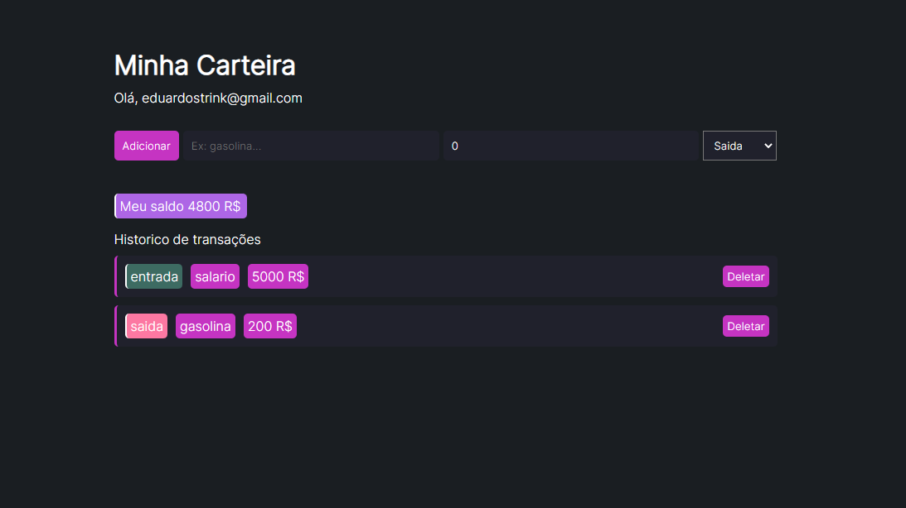

<h1 align="center">
    
</h1>

## 🧪 Tecnologias

Esse projeto foi desenvolvido com as seguintes tecnologias:

- [React](https://reactjs.org)
- [Javascript](https://www.javascript.com/)

## ✅ Funcionalidades
- Criação
- Exclusão
- Exibição do saldo
- Histórico de transações

## 🚀 Como executar

Clone o projeto e acesse a pasta minha-carteira.

```bash
$ git clone https://github.com/carloseduardoalvesviana/minha-carteira.git
$ cd minha-carteira
```

Para iniciá-lo, siga os passos abaixo:
```bash
# Instalar as dependências
$ yarn

# Iniciar o projeto
$ yarn start
```
O app estará disponível no seu browser pelo endereço http://localhost:3000.

## ☁ Deploy
https://minha-carteira-pearl.vercel.app/

## 💻 Projeto

Perfeito para controlar seus gastos.

---

Feito com 💜 by carlos viana
